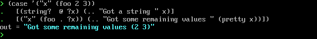
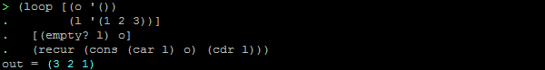
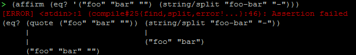
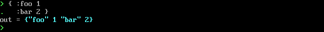
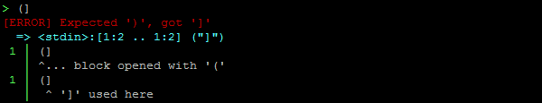

# Urn: A Lisp implementation for Lua

Urn is a new language developed by SquidDev, and demhydraz. Urn is a Lisp dialect with a focus on minimalism which
compiles to Lua.

## What?
 - A minimal Lisp implementation, with full support for compile time code execution and macros.
 - Support for Lua 5.1, 5.2 and 5.3. Should also work with LuaJIT.
 - Lisp-1 scoping rules (functions and data share the same namespace).
 - Influenced by a whole range of Lisp implementations, including Common Lisp and Clojure.
 - Produces standalone, optimised Lua files: no dependencies on a standard library.

## Features
### Pattern matching

### Various looping constructs

### Powerful assertion and testing framework

### First-class support for Lua tables

### Friendly error messages

## Getting started
We have a [getting started guide](tutorial/01-introduction.md) to help you get set up. Or you
can [clone the repo](https://gitlab.com/urn/urn) and jump right in!

The website also contains [documentation for all functions and macros](docs/lib.prelude.md), should you need to check
how something works.
